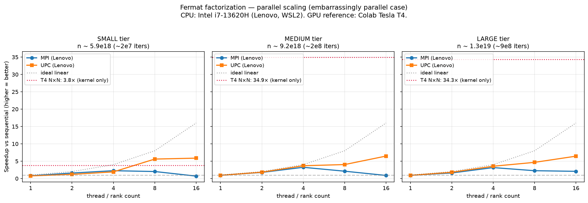
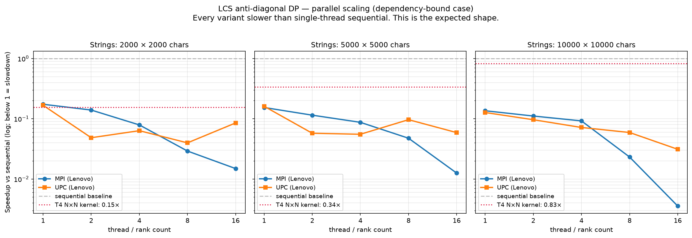

# Fermat vs LCS: when does parallelism pay off?

Two algorithms with opposite scaling profiles, each written four times
(sequential C, MPI, Berkeley UPC, CUDA). The question this project tries
to answer: throwing more processes at a problem doesn't always speed it
up. When does it, and when does it hurt?

## The concept

I picked two workloads that behave very differently under parallelism:

- **Fermat integer factorization** (an RSA-adjacent problem). The search
  `a² − n = b²` tries values of `a` independently, so every candidate
  can be tested by a different worker. Should scale well.
- **Longest Common Subsequence** as an anti-diagonal DP. Each cell
  `L[i][j]` needs `L[i−1][j]`, `L[i][j−1]`, and `L[i−1][j−1]` first,
  which forces a barrier between diagonals and limits how much you can
  actually parallelize.

Both are implemented four times using the same correctness inputs so the
outputs can be cross-checked. Then each is benchmarked at 1, 2, 4, 8, 16
threads on CPU and at three launch configurations on GPU.

## Paradigms covered

| Paradigm | Model | Runtime here |
| --- | --- | --- |
| Sequential C | single-thread baseline | `gcc -O2` |
| MPI | message-passing between processes | Open MPI 4.1.6, single node, `mpirun -np N` |
| Berkeley UPC | PGAS shared memory | UPC runtime 2022.10.0 + Translator 2.28.4, `upcrun -np N` |
| CUDA | GPU | nvcc 12.8, one Colab Tesla T4 |

## Repository layout

```
Project RSA/
  rsa_common.h         shared modulus + tier constants
  rsa_sequential.c     RSA encrypt/decrypt (round-trip self-check)
  fermat_sequential.c  baseline factorizer
  fermat_mpi.c         MPI factorizer with periodic MAXLOC+Bcast
  fermat_upc.c         UPC factorizer, PGAS shared flag
  fermat_cuda.cu       CUDA factorizer, grid-stride, volatile flag

Project LCS/
  lcs_common.h         @file-or-literal argv helper
  LCS_sequential.c     baseline DP + reconstruction
  LCS_mpi.c            MPI anti-diagonal with MPI_MAX reduce per diagonal
  LCS_upc.c            UPC anti-diagonal with upc_forall affinity
  LCS_CUDA.cu          CUDA anti-diagonal, grid-stride, split H2D/kern/D2H timing
  X_2000.txt Y_2000.txt X_5000.txt Y_5000.txt X_10000.txt Y_10000.txt
                       reproducible benchmark inputs (fixed seed)

bench/
  capture_env.sh            records CPU / gcc / mpicc / upcc versions -> env_lenovo.txt
  colab_cells.md            CUDA benchmark cells for Colab T4
  env_colab.txt             GPU environment capture
  env_lenovo.txt            CPU environment capture
  fermat_cuda_results.csv   raw Colab T4 timings (Fermat)
  fermat_results.csv        raw Lenovo CPU timings (Fermat)
  fermat_speedup.png        Figure 1
  gen_primes.py             Miller-Rabin prime search for tier moduli
  gen_strings.py            reproducible benchmark string generator (fixed seed)
  lcs_cuda_results.csv      raw Colab T4 kernel + transfer times (LCS)
  lcs_results.csv           raw Lenovo CPU timings (LCS)
  lcs_speedup.png           Figure 2
  plot_results.py           matplotlib figure generator
  run_fermat.sh             Fermat benchmark driver -> fermat_results.csv
  run_lcs.sh                LCS benchmark driver     -> lcs_results.csv
  summarize.py              median/speedup summary table
  verify_all.sh             cross-implementation correctness check
  verify_tiers.sh           quick per-tier RSA + Fermat smoke test
```

## Build & run

Reference environment: Ubuntu on WSL2 plus one NVIDIA GPU (Colab is
fine). The four toolchains are independent, so you can build any subset.

### Sequential + Fermat CPU variants

```bash
cd "Project RSA"
gcc  -O2 -Wall               -o rsa_seq     rsa_sequential.c
gcc  -O2 -Wall               -o fermat_seq  fermat_sequential.c -lm
mpicc -O2 -Wall              -o fermat_mpi  fermat_mpi.c        -lm
upcc                         -o fermat_upc  fermat_upc.c

./rsa_seq                                     # RSA round-trip self-check
./fermat_seq                                  # sequential factorization
mpirun --oversubscribe -np 4 ./fermat_mpi     # 4 MPI ranks
upcrun -np 4 ./fermat_upc                     # 4 UPC threads
```

Add `-DTIER_SMALL` or `-DTIER_LARGE` to any of the Fermat/RSA builds to
switch modulus size (the default is MEDIUM). The exact primes are in
`rsa_common.h`, along with a note on the RSA framing (short version
further down).

### LCS CPU variants

```bash
cd "Project LCS"
gcc  -O2 -Wall  -o lcs_seq  LCS_sequential.c
mpicc -O2 -Wall -o lcs_mpi  LCS_mpi.c
upcc            -o lcs_upc  LCS_upc.c

# correctness fixture
./lcs_seq                                     # -> "LCS = ASTRM", length 5
mpirun --oversubscribe -np 4 ./lcs_mpi
upcrun -np 4 ./lcs_upc

# benchmark input (@filename convention loads from file)
./lcs_seq @X_5000.txt @Y_5000.txt
mpirun --oversubscribe -np 8 ./lcs_mpi @X_5000.txt @Y_5000.txt
upcrun -shared-heap 512M -np 8 ./lcs_upc @X_5000.txt @Y_5000.txt
```

For sizes 5000 and up, UPC needs `-shared-heap 512M`. The default shared
heap can't fit the DP matrix.

### CUDA variants (Colab T4)

Full recipe is in `bench/colab_cells.md`. Short version:

```
nvcc -O2 -arch=sm_75  fermat_cuda.cu -o fermat_cuda
nvcc -O2 -arch=sm_75  LCS_CUDA.cu    -o lcs_cuda
./fermat_cuda [blocks] [threads]
./lcs_cuda @X_5000.txt @Y_5000.txt [blocks] [threads]
```

### Reproduce the benchmarks

```bash
bench/verify_all.sh           # cross-implementation correctness check
bench/run_fermat.sh           # writes bench/fermat_results.csv
bench/run_lcs.sh              # writes bench/lcs_results.csv
python3 bench/summarize.py    # median times + speedup tables
python3 bench/plot_results.py # regenerates the two speedup PNGs
```

## Results

### Environment

- **CPU:** Intel Core i7-13620H (10 cores / 16 threads, 6P + 4E), 16 GB RAM,
  Ubuntu on WSL2. GCC 10.5.0, Open MPI 4.1.6, Berkeley UPC 2022.10.0
  (Translator 2.28.4).
- **GPU:** NVIDIA Tesla T4 (16 GB, compute capability 7.5, driver 580.82.07),
  nvcc 12.8, hosted on Google Colab.

### A note on the CPU vs GPU comparison

The GPU numbers are from a Colab T4 and the CPU numbers are from my
laptop. Different machines, so the CPU vs GPU comparison isn't apples
to apples. In the plots I keep the GPU as a separate horizontal
reference line on the same speedup axis rather than mixing it into the
CPU curves. Comparisons within a single platform (MPI vs UPC on the
laptop, or 1×N vs N×N on the T4) are fair.

### Fermat — where parallelism helps



Median times in ms, with speedup vs sequential in parentheses:

| Tier | seq | MPI np=4 | MPI np=16 | UPC np=4 | UPC np=16 | T4 N×N (kernel) |
|---|---|---|---|---|---|---|
| SMALL  |  26 |  11.5 (2.3×) |  37.1 (0.7×) |  13.6 (1.9×) |   4.4 (5.9×) |   6.8 (3.8×) |
| MEDIUM | 263 |  81.4 (3.2×) | 296.0 (0.9×) |  71.4 (3.7×) |  40.7 (6.5×) |   7.5 (34.9×) |
| LARGE  | 715 | 226.5 (3.2×) | 344.5 (2.1×) | 201.8 (3.5×) | 111.0 (6.4×) |  20.8 (34.3×) |

What I see in this:

- UPC scales the best. At np=16 on the MEDIUM and LARGE tiers I'm
  getting around 6.4× speedup. It's well below the ideal 16×, but for
  a shared-flag search that's fine.
- MPI stops improving after np=4 and gets worse from there. I think
  this is because every ~4,096 iterations all ranks do an MPI_Allreduce
  to check if anyone found the answer, and that collective doesn't get
  cheaper as you add ranks. UPC avoids it by using a plain shared
  variable that everyone can read.
- The T4 with 65,536 threads (the N×N config) is around 34–35× on
  MEDIUM and LARGE. Fast, but see the machine-comparison note above.
- On the SMALL tier the GPU is only 3.8×. Fermat SMALL finishes in
  about 26 ms on the CPU sequentially; kernel launch and cudaMemcpy
  take a real chunk of that, so there's less room for the GPU to win.

### Fermat CUDA — comparing launch geometries

| Tier | 1×N (256 total) | N×1 (256 total) | N×N (65,536 total) |
|---|---|---|---|
| SMALL  |  105 ms |   60 ms |    6.8 ms |
| MEDIUM |  665 ms |  500 ms |    7.5 ms |
| LARGE  | 1,832 ms | 1,390 ms |   20.8 ms |

- 1×N and N×1 both only use 256 threads total, which is far too few for
  the T4. The T4 has 40 SMs and each wants 32-wide warps, so you need
  at least ~1,280 threads just to fill each SM once. Most of the GPU
  sits idle with 256.
- N×1 is faster than 1×N even though they run the same number of
  threads. Spreading them across 256 blocks gives the scheduler more
  room to hide latency across SMs than packing 8 warps into a single
  block.
- N×N (65,536 threads) is around 100× faster than either 256-thread
  config on MEDIUM and LARGE. Occupancy demo, basically.

### LCS — where parallelism doesn't help



Median times in ms. "Speedup" is included but every parallel cell is
below 1, meaning slower than sequential:

| Size (m=n) | seq | MPI np=4 | MPI np=16 | UPC np=4 | UPC np=16 | T4 N×N (kernel) |
|---|---|---|---|---|---|---|
| 2000  |   5 |   64.2 (0.08×) |    340.8 (0.01×) |   80.1 (0.06×) |   59.5 (0.09×) |   33 (0.15×) |
| 5000  |  31 |  355.4 (0.09×) |  2,474.5 (0.01×) |  561.1 (0.06×) |  526.2 (0.06×) |   86 (0.36×) |
| 10000 | 142 | 1,544.8 (0.09×) | 40,026.8 (0.004×) | 1,986.0 (0.07×) | 4,573.2 (0.03×) | 172 (0.83×) |

What I see:

- Every parallel variant loses to sequential. LCS as an anti-diagonal
  DP has a global barrier between every diagonal, and there are `m+n−1`
  of them. Communication cost grows with the problem, useful work per
  barrier doesn't.
- The worst case here is MPI at np=16 on 10000-char strings: 40 seconds
  vs 142 ms sequential. That's a 281× slowdown. This is
  synchronization cost showing up in the numbers.
- GPU comes closest to breaking even. At 10000 chars the N×N kernel is
  172 ms vs 142 ms sequential — still 0.83×, still losing, just less
  badly. The T4's 2,560 cores can't beat the anti-diagonal barrier any
  more than MPI ranks can.
- GPU LCS is still much faster than CPU-parallel LCS (172 ms vs 40
  seconds at 16 ranks). The GPU absorbs sync overhead better than MPI
  does, but neither actually beats sequential.

### Why kernel time isn't the whole GPU story

For LCS on GPU, kernel time is what I compare against the CPU DP fill.
But the total GPU wall time also includes H2D (uploading the two
strings) and D2H (downloading the completed matrix so I can rebuild
the subsequence on the host). At 10000 chars, H2D is 1.8 ms; D2H is
266 ms. Half the total time is just shipping the matrix back. I report
kernel, H2D, and D2H separately so this doesn't get hidden.

## A CUDA bug worth writing about

The first Fermat CUDA I ran on Colab printed:

```
Recovered factors: p = 73992624537, q = 78905087309
Matches n : yes
```

The "Matches n : yes" was wrong. Those two numbers multiplied together
are about 5.83×10²¹, way bigger than n. But the check itself ran in the
same 64-bit unsigned arithmetic as the search, and 5.83×10²¹ happens to
wrap around modulo 2⁶⁴ to exactly n. So the self-test convinced itself
the answer was right.

I only caught this because the CPU implementations printed different
numbers. All four should have recovered the same p, q, and only CUDA
disagreed. That's what tipped me off. From there:

1. My grid-stride loop let threads walk past `a = 2^32`. Above that
   value, `a * a` overflows uint64.
2. An overflowed `a*a - n` is just garbage. Sometimes that garbage
   happens to have an integer square root (roughly a 1 in 4 billion
   chance per test, which adds up fast with tens of thousands of
   threads all checking).
3. Fix: bound the kernel's search at `a < 2^32`. That's safe for the
   moduli I use because `(p+q)/2` is always well below that.

The bigger takeaway for me was that a self-test which shares arithmetic
with the code under test can silently validate wrong answers.
Cross-checking against independent implementations is what actually
found it.

## About the RSA framing

Being explicit about what this project is and isn't:

Fermat factorization here is a benchmark workload. It's a concrete
integer search that happens to be embarrassingly parallel and small
enough to read end to end. It is not an attack on real RSA.

- The n used here is 63 bits. Real RSA is 2048 to 4096 bits.
- The primes here are about 2^31 apart. Fermat is only a threat to
  real RSA if `|q − p| < n^(1/4)`. For a 2048-bit n that's within
  around 2^512, which basically never happens with a keygen that picks
  primes randomly. My gap is about 40,000× farther than that threshold
  even for the toy n I use.
- What makes THIS n solvable in seconds is that it's deliberately
  small, not that the primes are cryptographically "close".

`rsa_sequential` exists as a self-check: build an RSA keypair from p
and q, encrypt then decrypt a test message, and confirm the round-trip
works. Then Fermat recovers p, q from n. If those don't match the
originals, either the arithmetic overflowed or one of the "primes"
isn't actually prime.

## Limitations and what I'd change next time

- CPU is on my laptop, GPU is on a Colab T4. Same-machine numbers would
  be more honest — a workstation with an NVIDIA card, or all four on a
  cloud box.
- The LARGE Fermat tier is close to the uint64 ceiling. My `a < 2^32`
  bound in the CUDA kernel is a hard limit. To benchmark bigger n I'd
  need 128-bit arithmetic on the GPU.
- LCS memory grows as m·n. The 10000-char matrix is 400 MB. Going to
  20000 chars is 1.6 GB, so I'd need a rolling-window DP that only
  keeps the last two diagonals. That would give a longer sequential
  baseline and might let CUDA finally beat sequential.
- MPI Fermat is limited by the collective. `MPI_Allreduce` every 4,096
  iterations is a compromise, not the best you can do. A one-sided
  `MPI_Put` on a shared flag would probably close the gap to UPC.
- LCS reconstruction is untimed. I measure DP fill only; the
  reconstruction runs on the host afterwards. Fair for a "which
  paradigm parallelizes the DP" question, less fair for a total
  "solve LCS" wall-clock.
- Five runs per cell isn't a lot. I report medians. A more rigorous
  study would run 30+ per cell and report confidence intervals.

## Notes

Course context: Parallel Programming, UIR 3rd year (S7). The four base
implementations started as class assignments; this repo rewrites them
for benchmark comparability and adds the benchmark harness, the plots,
and this writeup.

Third-party dependencies: Open MPI, Berkeley UPC + Translator (LBL),
CUDA toolkit + Colab T4 runtime, matplotlib.
